# Multi-Producer Multi-Consumer (MPMC) Fixed-Size Queue

Let's start with a simple representation.

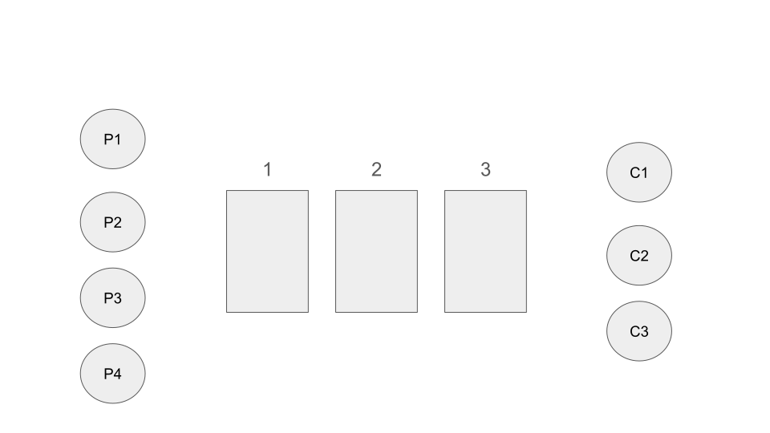

Now let's say producer P1 has a job T that needs to be processed.

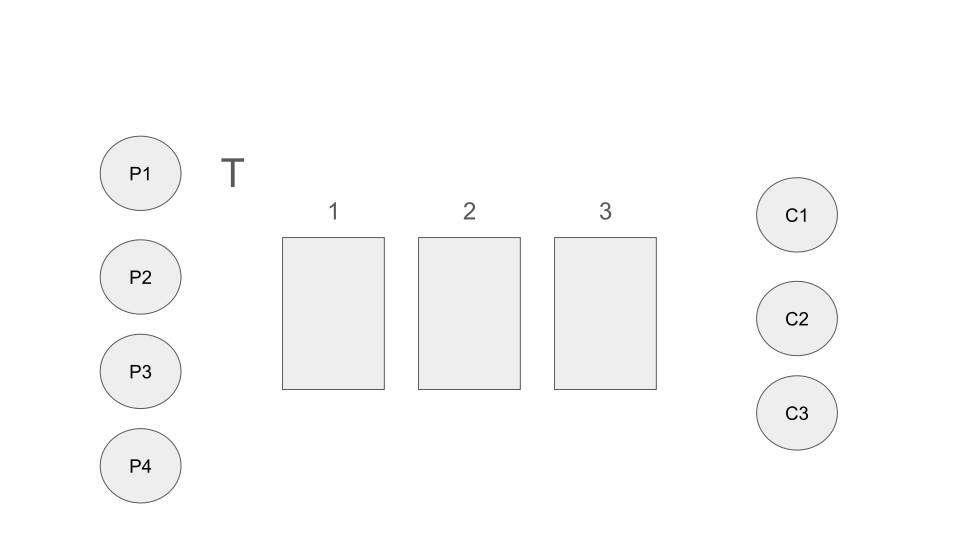

Since our queue is empty, it puts the job into the first available cell.

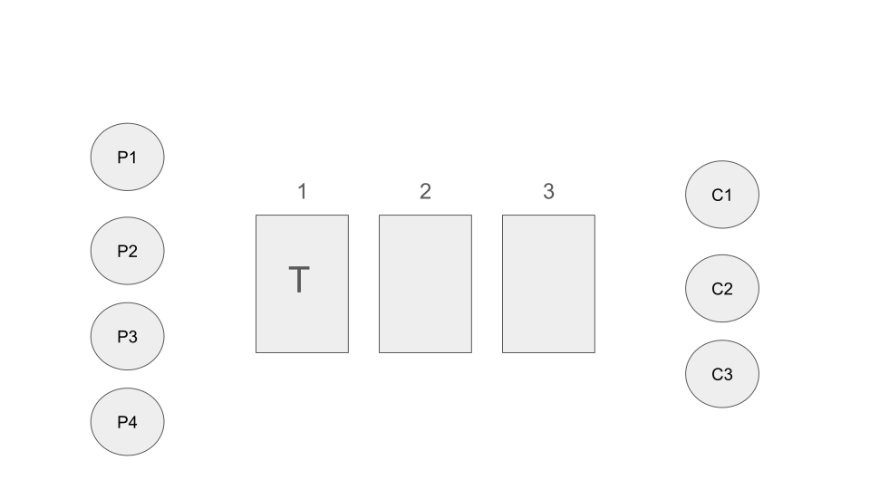

Now the same producer has another job L.

It places it into the second cell.

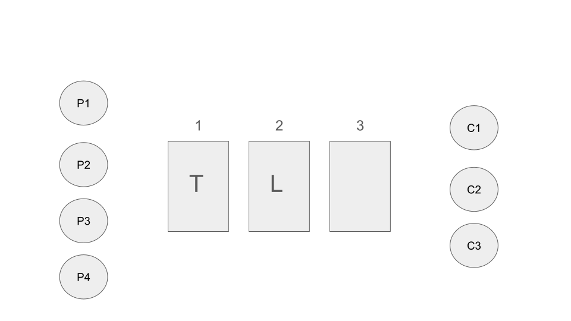

Another job A

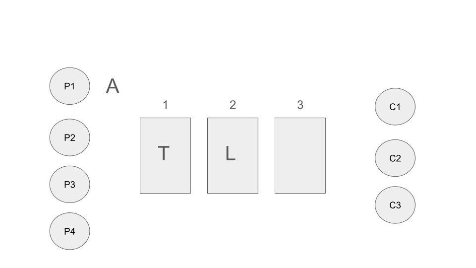

is placed in the last available cell.

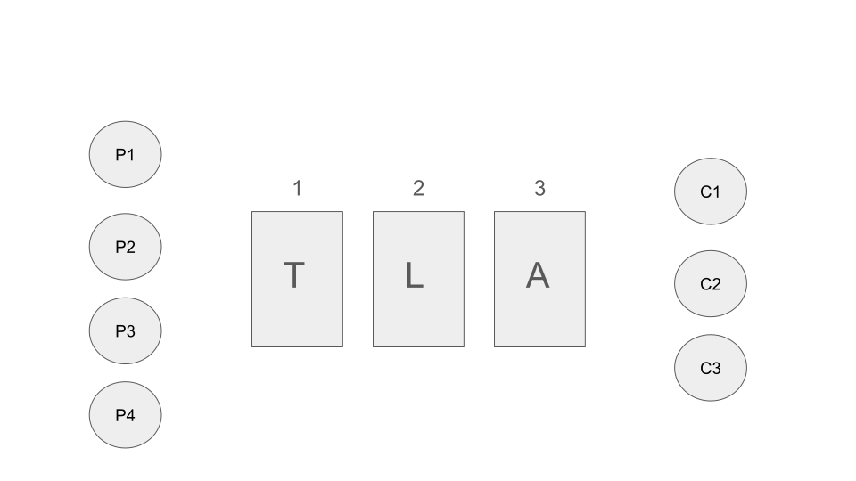

If any of the producers have another job, they would have to wait.

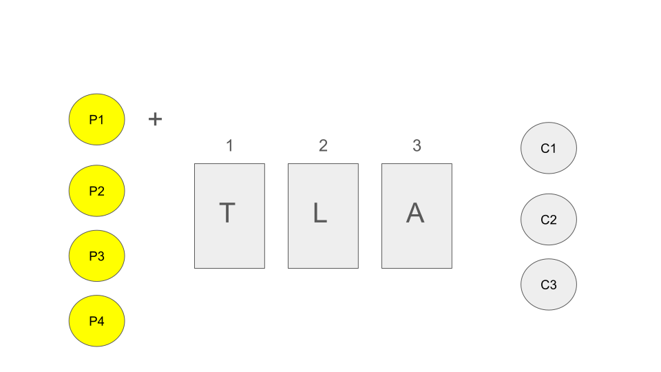

Now let's say consumer C1 becomes available.

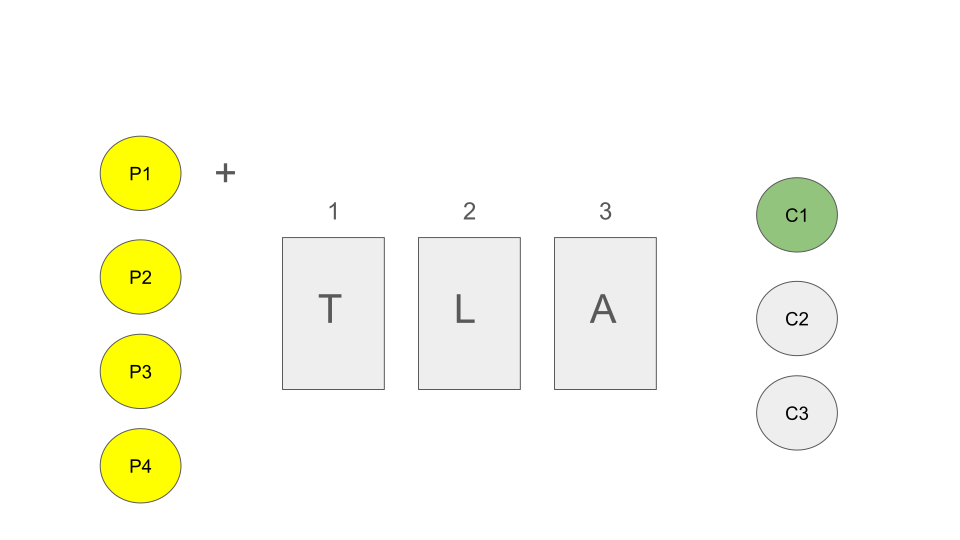

It picks up the job from the fist cell. Now there is one more spot.

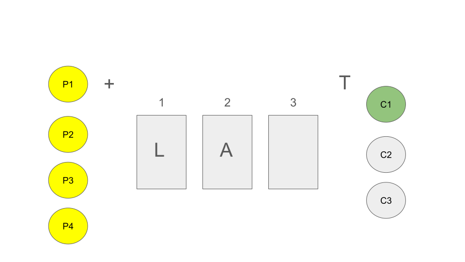

Producers can now put the last job into the available cell.

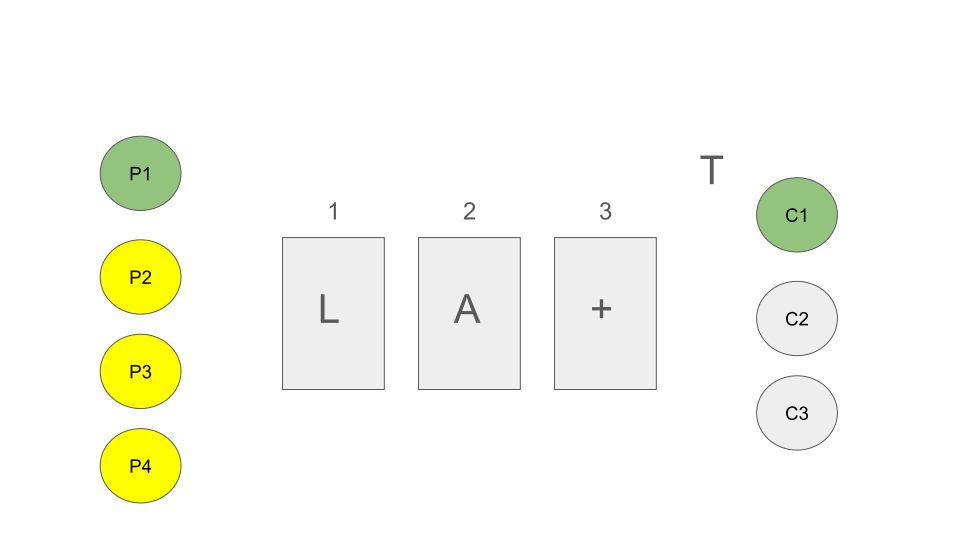

Eventually jobs L and A get picket up by other consumers.

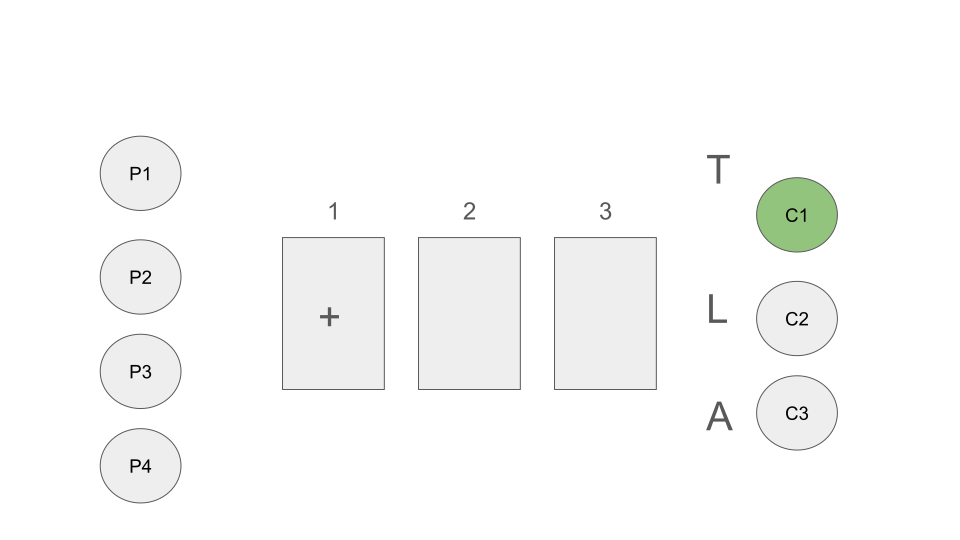

We have only last job left. Producers have nothing more to add.

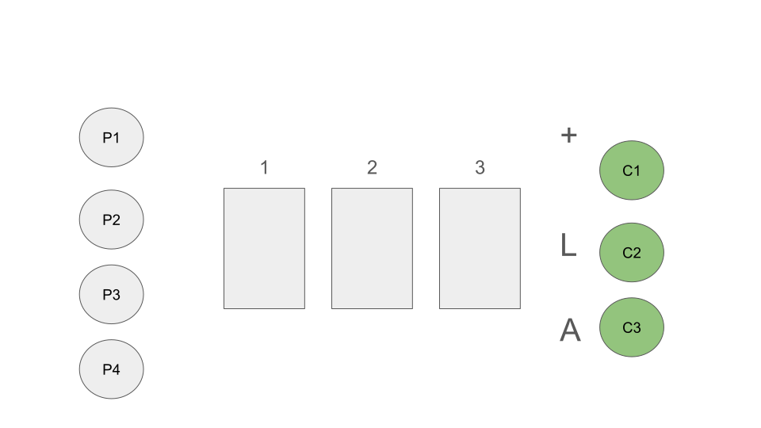

All produced jobs are processed. We are back to the original state where we started.

Let's note that this is only possible scenario.
Describing them all like that would take a long time.
The picture gives us a general idea how things suppose to work.
